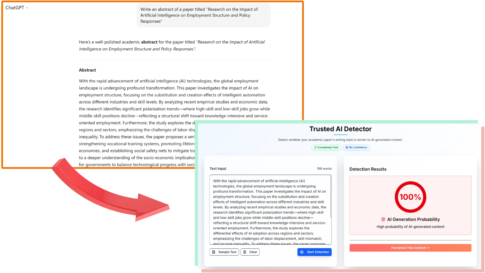
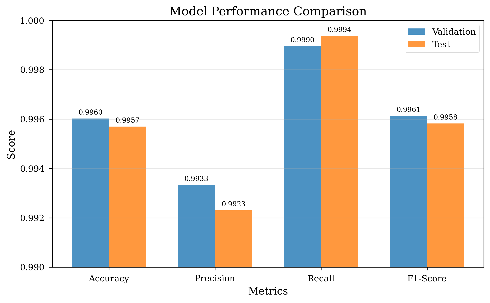
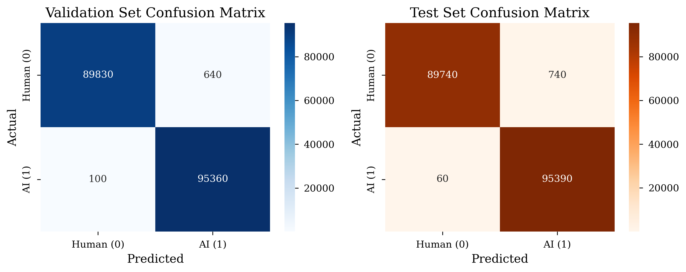

# 🧠 Kill Detector —— 学术论文AI检测器

BERT 学术文本检测模型 | 免费、本地部署 | Turnitin 替代方案

Kill Detector是一个 BERT 二分类模型，用于识别学术论文更接近人类写作还是AI写作风格。它可作为 Turnitin 等高昂商业检测器的开放替代方案，适合学生、个人科研者、本地部署用户。



🌐 访问 [https://followsci.com/ai-detection](https://followsci.com/ai-detection) 可在线使用

**Language / 语言**: [English](README_EN.md) | [中文](README_ZH.md)

---

## 🧩 背景与立场

### 💡 为什么做这个项目？

Turnitin 等商用学术检测服务价格昂贵，对学生、研究者和自费科研人员不够友好。论文检测应当透明、公平、可解释，而不是商业黑箱。所以我们开放模型，为社区提供透明、低成本方案。

### ⚠️ 对 AI 文本检测的哲学立场

AI 的使命是提高效率，而不是让人回到手写时代。

AI 写作在词汇选择、句法结构、逻辑连贯性上远超大部分人类写作者。

❌ **"写得像 AI" ≠ 学术不端。**

学术诚信不应依靠语言风格裁决，而应该回到内容真实性。

仅凭风格判断论文质量非常荒谬。

我们真正应该关注的不是"你有没有用 AI"，而是内容是否真实、可靠、没有虚假生成。

换句话说：**我们应该检测的是 AI 幻觉，而不是 AI 写作。**

⚠️ **注意**：本项目目前仅属于**风格检测（stylometric detection）**，未来目标是构建学术内容真实性检测与AI幻觉识别体系。

---

## 🤖 模型介绍

### ✨ 特性

使用约140万条数据进行训练

- **高准确率**：在学术文本检测上达到 99.57% 的准确率和 99.58% 的 F1 分数
- **低误报率**：仅 0.82% 的误报率，最大程度减少错误指控
- **极高召回率**：99.94% 的召回率确保AI生成内容很少被遗漏
- **专为学术文本优化**：专门针对学术写作模式进行优化
- **基于BERT架构**：基于 BERT-base-uncased 构建，具有强大的语义理解能力

---

## 🎯 性能指标

### 测试集结果

| 指标 | 数值 |
|------|------|
| **准确率** | 99.57% |
| **精确率** | 99.23% |
| **召回率** | 99.94% |
| **F1分数** | 99.58% |
| **假阳性率** | 0.82% |
| **假阴性率** | 0.06% |



### 混淆矩阵（测试集）

| | 预测：人类 | 预测：AI |
|---|---|---|
| **实际：人类** | 89,740 (真阴性) | 740 (假阳性) |
| **实际：AI** | 60 (假阴性) | 95,390 (真阳性) |



---

## 🚀 快速开始

模型文件已保存到 [https://huggingface.co/followsci/bert-ai-text-detector](https://huggingface.co/followsci/bert-ai-text-detector)

### 安装

```bash
pip install transformers torch
```

### 运行

```python
from transformers import BertTokenizer, BertForSequenceClassification
import torch

model_name = "followsci/bert-ai-text-detector"
tokenizer = BertTokenizer.from_pretrained(model_name)
model = BertForSequenceClassification.from_pretrained(model_name)
model.eval()

text = "Your academic paragraph here..."
inputs = tokenizer(text, return_tensors="pt", truncation=True, max_length=512)

with torch.no_grad():
    outputs = model(**inputs)
    probs = torch.nn.functional.softmax(outputs.logits, dim=-1)
    ai_prob = probs[0][1].item() * 100
    human_prob = probs[0][0].item() * 100
    
    print(f"AI生成概率: {ai_prob:.1f}% | 人类写作概率: {human_prob:.1f}%")
```

### 参数说明

- **标签**：`0 = 人类`, `1 = AI`
- **最大长度**：512 tokens

---

## 🚧 我们正在做的事

### 研究方向

| 未来方向 | 说明 |
|---------|------|
| 事实一致性验证 | 引用链检查、文献检索对比 |
| AI 幻觉检测 | 重点区分真实 vs 虚构内容 |
| 引用真实性 | 防止"假引用"与"模型编造文献" |
| 学术逻辑一致性 | 结构与推理校验 |

### 最终目标

构建"AI辅助真实学术"的检测框架，而不是"反AI写作"工具。

---

## ✨ 关于人性化改写模型

我们还训练了一个学术论文人性化改写模型：

- 保持学术表达风格
- 消除 AI 写作痕迹
- 避免被风格检测误判

📌 该模型可以通过网站 [https://followsci.com/ai-rewrite](https://followsci.com/ai-rewrite) 免费使用。

---

## 📌 最后

> **AI 不应成为被审判者，而应成为支持知识创造的工具。**  
> **我们的目标不是惩罚 AI，而是保护学术真实。**

感谢阅读。欢迎 Star ⭐ 支持开放学术工具生态。

